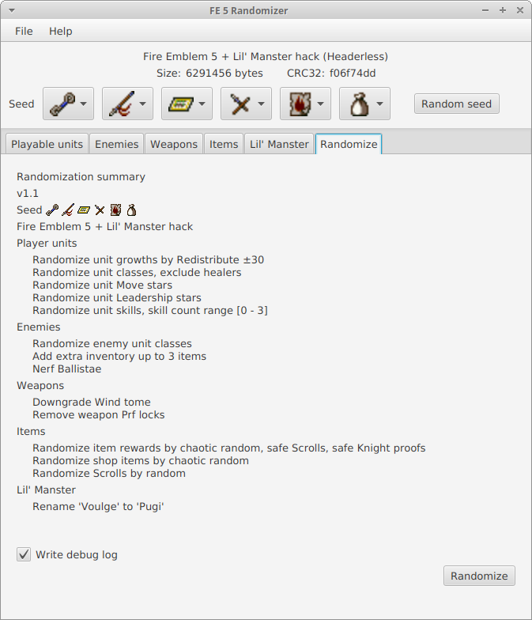
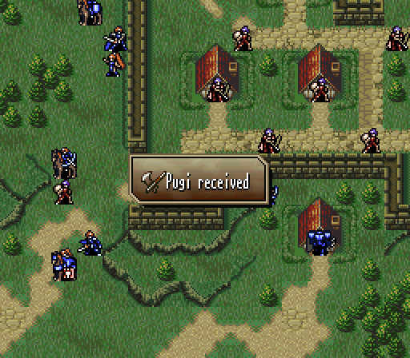
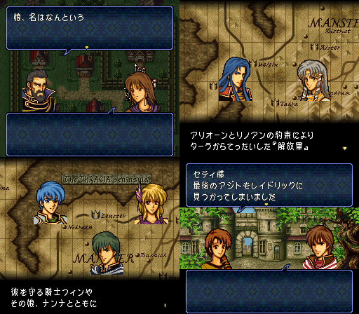

Fire Emblem Thracia 776 Randomizer
==================================

Works with most Fire Emblem Thracia 776 ROM versions.

## Can randomize:

### Playable units
Bases, Growths, Classes, Movement stars, Leadership stars, Skills.

### Enemy units
* Classes, Movement stars, Leadership stars, Skills.
* Add extra inventory items to enemies.
* Nerf Ballistae.

### Weapons
* Might, Accuracy, Weight, Critical, Max uses, Cost.
* Chance to add...
    * Blade effect (Poison, Devil, Steal HP, Stone, Hell, Berserk, Sleep).
    * Weapon skill.
    * +5 Stat bonus.
* Remove Prf locks.

### Items
* Randomizes item rewards (chests/houses/events), Shops inventory and Scroll attributes.

### Project Exile / Lil' Manster customization
* Rename *Bhuj/Vouge* to _**Pugi**_

### Portrait palette randomizer

